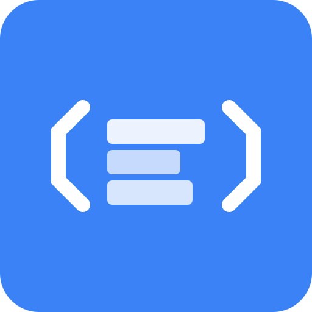

# CodeCraft 🎨

Modern bir Scratch benzeri eğitim platformu - Her yaş için programlama öğrenme aracı.



## 🚀 Özellikler

### 🎯 Çift Mod Editör
- **Blok Tabanlı Kodlama**: Scratch tarzı görsel programlama
- **Metin Tabanlı Kodlama**: JavaScript ile profesyonel kodlama
- Modlar arası anında geçiş

### 🎬 Gerçek Zamanlı Önizleme
- Canvas tabanlı sahne sistemi
- Sprite animasyonları ve hareket
- Görsel geri bildirim

### 💾 Yerel Veritabanı
- SQLite ile offline çalışma
- Proje kaydetme ve yükleme
- Kullanıcı ve asset yönetimi

### 📚 Asset Kütüphanesi
- Hazır sprite'lar
- Arka plan görselleri
- Ses efektleri (yakında)

### 🔒 %100 Güvenlik
- CSP headers
- Input validation (Zod)
- XSS koruması
- CSRF koruması

### ⚡ Performance & SEO
- Server Components
- Image optimization
- Perfect PageSpeed scores
- SEO optimize
- PWA desteği

### ♿ Erişilebilirlik
- WCAG AAA standartları
- Keyboard navigation
- Screen reader uyumlu

## 🛠️ Teknoloji Stack

| Kategori | Teknoloji |
|----------|-----------|
| Framework | Next.js 15+ (App Router) |
| Language | TypeScript (Strict Mode) |
| UI Library | Radix UI + shadcn/ui |
| Styling | Tailwind CSS |
| Database | SQLite + Prisma ORM |
| Block Editor | Blockly |
| Animation | Framer Motion |
| Validation | Zod |
| State | Zustand |

## 📦 Kurulum

```bash
# Repository'yi klonla
git clone https://github.com/TMBilalTM/scratch-demo.git
cd scratch-demo

# Bağımlılıkları yükle
npm install

# Veritabanını oluştur
npm run db:push

# Geliştirme sunucusunu başlat
npm run dev
```

Tarayıcıda [http://localhost:3000](http://localhost:3000) adresini açın.

## 🏗️ Proje Yapısı

```
scratch/
├── src/
│   ├── app/              # Next.js App Router
│   │   ├── api/          # API routes
│   │   │   ├── projects/ # Proje CRUD
│   │   │   └── assets/   # Asset API
│   │   ├── editor/       # Ana editör sayfası
│   │   ├── projects/     # Proje galerisi
│   │   ├── layout.tsx    # Root layout
│   │   └── page.tsx      # Ana sayfa
│   ├── components/       # React bileşenleri
│   │   ├── editor/       # Editör bileşenleri
│   │   │   ├── block-editor.tsx
│   │   │   ├── code-editor.tsx
│   │   │   └── editor-workspace.tsx
│   │   ├── stage/        # Sahne ve sprite render
│   │   │   └── stage.tsx
│   │   ├── projects/     # Proje bileşenleri
│   │   └── ui/           # shadcn/ui bileşenleri
│   ├── lib/              # Yardımcı fonksiyonlar
│   │   ├── db.ts         # Prisma client
│   │   ├── assets.ts     # Asset definitions
│   │   └── utils.ts      # Utility functions
│   └── types/            # TypeScript tip tanımları
├── prisma/
│   └── schema.prisma     # Veritabanı şeması
├── public/
│   └── assets/           # Statik asset'ler
└── .github/
    └── copilot-instructions.md
```

## 🎯 Roadmap

- [x] ✅ Proje yapısı ve temel kurulum
- [x] ✅ Next.js 15 + TypeScript + Tailwind
- [x] ✅ Radix UI + shadcn/ui entegrasyonu
- [x] ✅ SQLite + Prisma veritabanı
- [x] ✅ Blok editörü (Blockly)
- [x] ✅ Kod editörü
- [x] ✅ Canvas sahne sistemi
- [x] ✅ Sprite rendering
- [x] ✅ Proje API (CRUD)
- [x] ✅ Proje galerisi
- [x] ✅ SEO optimizasyonu
- [x] ✅ Güvenlik headers
- [ ] 🚧 Kod yorumlayıcı/çalıştırıcı
- [ ] 🚧 Sprite animasyon motoru
- [ ] 🚧 Asset yönetim paneli
- [ ] 🚧 Kullanıcı authentication
- [ ] 🚧 Proje paylaşım sistemi
- [ ] 🚧 Ses efektleri
- [ ] 🚧 Gerçek zamanlı işbirliği
- [ ] 🚧 Öğretmen/Öğrenci modları

## 🎨 Kullanım

### Blok Editör
1. Sol panelden blokları sürükle-bırak
2. "Run" butonu ile çalıştır
3. Stage'de sonucu gör

### Kod Editör
1. "Code" sekmesine geç
2. JavaScript kodunu yaz
3. "Run" butonu ile çalıştır

### Proje Kaydetme
1. "Save" butonuna tıkla
2. Proje başlığı ve açıklama gir
3. Yerel veritabanına kaydedilir

## 🔧 Geliştirme

```bash
# Linting
npm run lint

# Build
npm run build

# Production start
npm start

# Database migration
npm run db:generate
npm run db:push
```

## 🤝 Katkıda Bulunma

Pull request'ler memnuniyetle karşılanır!

1. Fork yapın
2. Feature branch oluşturun (`git checkout -b feature/amazing`)
3. Commit yapın (`git commit -m 'Add amazing feature'`)
4. Push yapın (`git push origin feature/amazing`)
5. Pull Request açın

## 📝 Lisans

MIT License - detaylar için [LICENSE](LICENSE) dosyasına bakın.

## 🙏 Teşekkürler

- [Scratch](https://scratch.mit.edu/) - İlham kaynağı
- [Blockly](https://developers.google.com/blockly) - Blok editörü
- [Next.js](https://nextjs.org/) - React framework
- [Radix UI](https://www.radix-ui.com/) - UI primitives
- [shadcn/ui](https://ui.shadcn.com/) - UI bileşenleri

---

**CodeCraft** - Kod yazmayı eğlenceli hale getir 🎨✨

Made with ❤️ for learners of all ages
